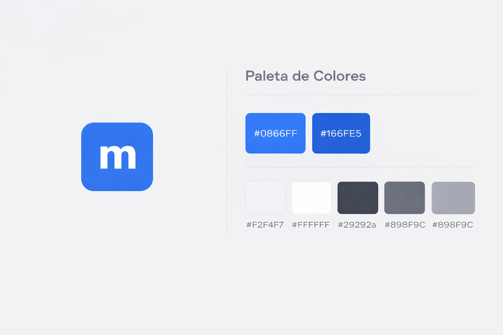

# Identidad de marca

## Nombre del proyecto

**marketplease!**

El nombre del proyecto busca transmitir cercanía y familiaridad, haciendo referencia directa al marketplace desarrollado y ampliamente utilizado por la empresa de software Meta, utilizando una parodia de su nombre y tomando referencias del mismo para disposiciones visuales, decisiones de diseño y criterios técnicos.

---

## Logo y Paleta de colores

El logotipo de *marketplease!* fue diseñado con un enfoque simple, del mismo modo referenciando y parodiando al logotipo de meta, así tambien se usaron las mismas referencias para transmitir la misma identidad con la paleta de colores seleccionada.

La siguiente imagen presenta el logotipo del proyecto junto con la paleta de colores utilizada como identidad visual de la aplicación.

